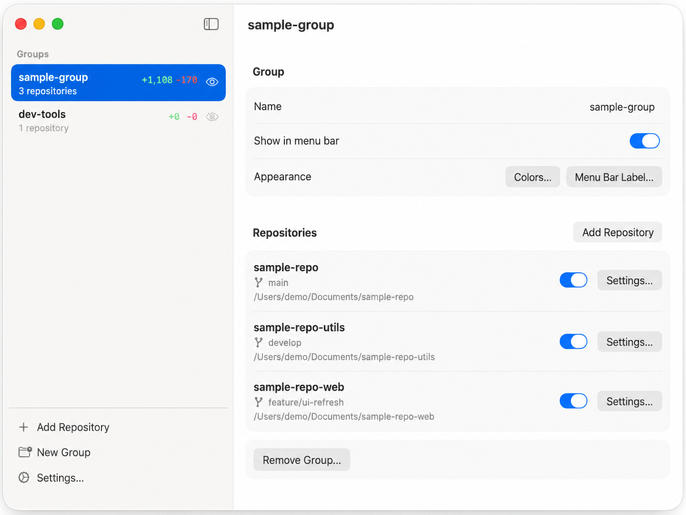
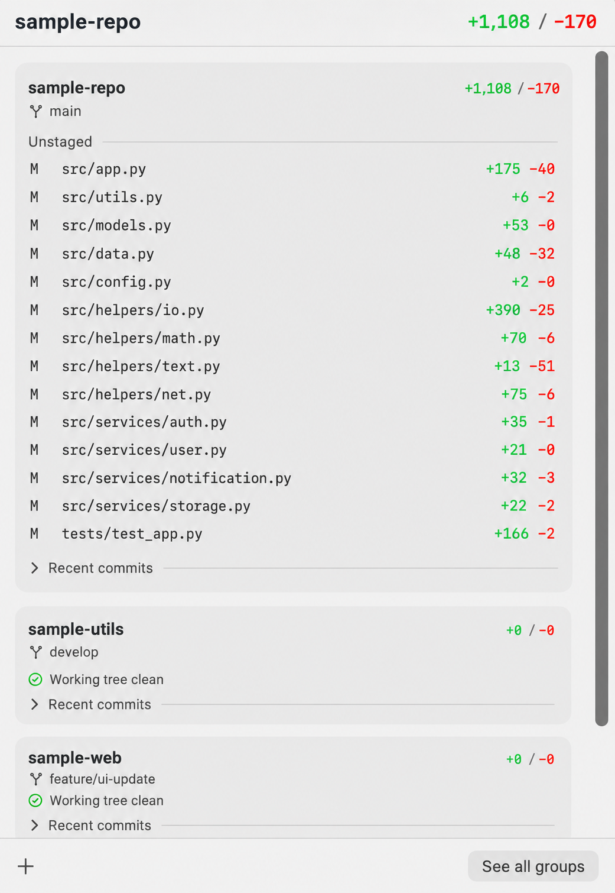

<p align="center">
  
</p>

# Diffy

Diffy is a small native macOS menu bar app for solo developers. It watches local git repositories and shows live working-tree diff stats directly in the menu bar.

Diffy is local-only. It does not use GitHub, GitLab, Bitbucket, PRs, issues, cloud services, or accounts. Its git commands are read-only with one explicit, user-initiated exception: removing a linked worktree from the in-app confirmation dialog.

## Status

v0.11.0 — available via Homebrew Cask. The app uses macOS 26 APIs and is ad-hoc signed (not Developer ID signed or notarized). Install instructions below include the required manual Gatekeeper quarantine-clearing step.

This release is the interface refresh: a menu-bar badge that carries each group's colour, a narrower popover built like Apple's own menu extras, and a window with a system sidebar and an inline inspector. The previous interface stays available behind Settings → Interface → Classic while the new one settles. The release also fixes a freeze on repositories with thousands of changed files: the popover now shows file lists a page at a time.

Diffy remains focused on its original local-only, menu-bar-first scope.

## Features

- **Groups**: every repo belongs to a group, and each group owns one menu-bar item, one colour, its own diff colours, and an optional small label (1–2 characters or an emoji, before or after the counts). A group shows the aggregate `+x / −y` of its counted members, `±` when everything is clean, counts above 9,999 as `10k`, and a warning triangle when a repository can't be read. The group's colour draws a pill behind the counts, so several groups stay apart at a glance.
- **Popover**: left-click a group's menu-bar item for a 340 pt popover scoped to that group. The header has the totals, a green/red ratio bar, branch, file count and refresh time; below it, **Changes** or **History**. File rows put the name first and the folder dimmed, with the status tile and `+a −b` at the right. Click a row to open the file in your editor, hover for Reveal in Finder and Copy Path, or right-click for the same. A group with several repositories shows each on its own platter — name and ⋯ on top; worktree, branch, file count and `+/−` beneath — with its four largest files and a "Show 50 more" row that pages through the rest; the ⋯ menu offers Reveal in Finder, Copy Path, Copy Branch Name and Remove Worktree…. The footer has Add Repository… and Open Diffy (⌘O). Esc closes.
- **History**: each repository's last 1–20 commits (set per repository) with short SHA, subject, age, and whether the commit is on the configured upstream, local only, or has no upstream. Expanding a commit shows file statuses and `+/-` totals, never source hunks. Commit rows offer Copy SHA and Copy Subject; historical file rows can copy the path or open the current working-tree version when it exists.
- **Diffy window**: the occasional configuration window has a sidebar of groups (coloured tile, live counts, drag to reorder, context menu to hide, show or remove, New Group at the foot) and an inspector with a live preview of the menu-bar badge, the Show in menu bar toggle, label and position, group colour and diff colours edited inline, and the group's repositories with branch, path and status. ⓘ on a repository opens its settings sheet (group, editor, commit history limit, count in totals, safe removal). Removing a group asks whether its repositories stay in Diffy as separate groups or go with it. The toolbar + (⌘O) adds a repository. App settings (Interface, Open at Login, updates, version) live in Settings (⌘,).
- **Adding a repository** is one step: the open panel has an "Add to" menu for a new group or an existing one, whether you start from the popover or the window.
- **Hide a group from the menu bar** from its inspector, the sidebar context menu, or by right-clicking its menu-bar item; the item disappears until toggled back on. Per-repository "Count in totals" silences a noisy repo within a group without removing the item.
- The menu-bar item's right-click menu has Open Diffy, Settings…, Hide "group" from Menu Bar, and Quit Diffy. Closing the window hides Diffy back to the menu bar; opening Diffy again from the Dock, Finder or Spotlight shows it, which is also the way back in when every group is hidden. ⌘Q quits.
- **Branch labels** appear in the popover and the window. Detached HEAD shows the short SHA.
- **Linked worktrees** discovered automatically from `git worktree list --porcelain` and shown indented under their family owner, each with its own diff stats and branch. Manually-added worktrees stay as top-level rows and are never duplicated under a sibling. Remove a finished auto-managed worktree from the popover's ⋯ menu or the settings sheet via a confirmation dialog; Diffy never uses `--force`, so dirty worktrees must be handled in your terminal first.
- Open changed files in a configured editor (Xcode, Cursor, VS Code, Zed, or a custom shell command). Deleted-file rows are shown for context but are not opened from the working tree.
- **Classic interface**: Settings → Interface → Classic brings back the 0.10.0 look, including the Standard / Apple Glass appearance setting, until the new interface is settled. The switch is temporary.
- **Launch at Login** toggle in Settings (requires Diffy installed to `/Applications`).
- Filesystem-triggered refresh with polling fallback.
- Homebrew updates today, with Sparkle packaged behind release metadata for a future appcast.

## Screenshots

At a glance, Diffy lives in the menu bar: one pill per group in the group's colour, with its aggregate working-tree diff.


Diffy's window is an occasional management surface for groups, repositories, and the menu-bar badge.



The menu-bar popover breaks a group down by repository, branch, changed file, status, and per-file diff counts.



## Build and Run Locally

From the Mac terminal:

```bash
swift test
./script/build_and_run.sh
```

The run script builds the SwiftPM target, creates `dist/Diffy.app`, ad-hoc signs it, and launches it.

## Package a Release

```bash
./script/package_release.sh <version> <build>
```

The zip is created at `dist/release/Diffy-<version>.zip`.

## Install

The easiest path is Homebrew:

```bash
brew tap tiliakoos/diffy
brew install --cask diffy
xattr -dr com.apple.quarantine /Applications/Diffy.app
```

The `xattr` step is required because Diffy is ad-hoc signed and not notarized — macOS will block it on first launch without it.

To upgrade an existing install:

```bash
brew upgrade --cask diffy
xattr -dr com.apple.quarantine /Applications/Diffy.app
```

## Auto-Updates

Diffy includes Sparkle integration, but update checks are enabled only in release bundles that include a Sparkle appcast URL and EdDSA public key. See `docs/release.md`.

## License

Copyright (C) 2026 Nick Tiliakos.

Diffy is licensed under the MIT License. You may use, copy, modify, and distribute it under the terms in [LICENSE](LICENSE).

Released app bundles include `LICENSE`, `THIRD_PARTY_NOTICES.txt`, and `SOURCE_CODE.md` in `Diffy.app/Contents/Resources`.

## Read-Only Guarantee

Diffy is read-only with one explicit, user-initiated exception: removing a linked worktree via the in-app confirmation dialog (which runs `git worktree remove <path>` without `--force`). All other git operations Diffy performs (`diff`, `status`, `log`, `show`, `rev-list`, observational `rev-parse`, and `worktree list`) are strictly observational, run with `GIT_OPTIONAL_LOCKS=0` and `--no-optional-locks`. Commit publication labels compare against local remote-tracking refs; Diffy never fetches. Diffy never stages, commits, checks out, cleans, resets, rebases, merges, or otherwise mutates a repository's working tree.
